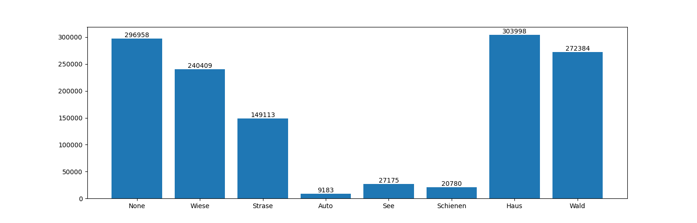

# PDS Team Gyrocopter

Projekt Data Science 1 | Sommersemester 2022

------

# Bildsegmentierung von Luftaufnahmen der Stadt Oldenburg

## Installation

1. Download Python 3.10
2. Download Pycharm
3. Projekt klonen
4. Benötigte Packages installieren (Bestätigung der automatischen Installation durch `requirements.txt`)

## Dokumentation

Die geforderten Abgabedateien befinden sich im Ordner `documentation`.
Der Quelltext wurde dokumentiert und befindet sich im Order `Code` und `Modelling`.

## Annotation

Insgesamt wurden 37 Bilder annotiert, wobei der Inter-Annotator-Agreement bei einem Bild mit 0,66 (substantial agreement) deutlich zeigt,
dass die Annotation trotz Annotationsrichtlinien schwierig war.

- Annotierte Klassen:
  - None
  - Wiese
  - Straße
  - Auto
  - See
  - Schienen
  - Haus
  - Wald

Die folgende Grafik zeigt die Anzahl der Annotierten Pixel pro Klasse.

Zur Kontrolle der Annotation wurden das RGB-Bild, die Annotation und die Klassenverteilung des Bildes gegenübergestellt.

## Ergebnisse

- Vorhersage des Gesamtbildes mit dem besten Modell `baseline3_nn_for_pixel.h5`
  - label_mapping **ohne_Auto_See** siehe `Code/functions/class_ids`

- Eine genauere Darstellung der Ergebnisse wurde durch Gegenüberstellung der Annotation, der Vorhersage, der Nachbearbeitung der Vorhersage mit dem RGB-Bild zeigt das folgende Beispielbild.

## Evaluierung

### baseline3_nn_for_pixel.h5

- Accuracy Train: 84,64 %
- Accuracy Test: 82,1 %

